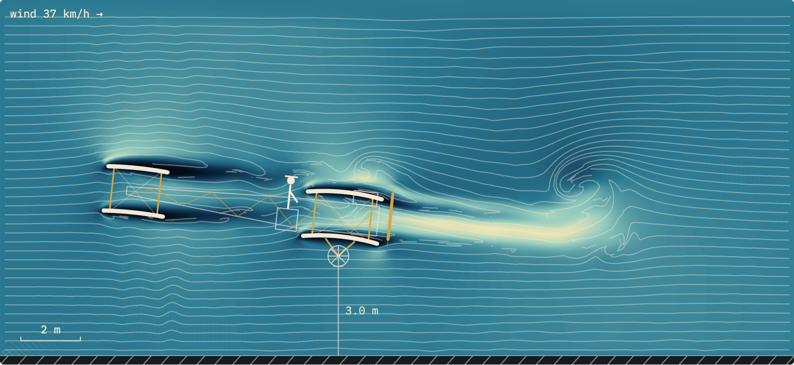

# The 14-bis Wind Tunnel

An interactive, real-time wind tunnel for a side-view slice of **Santos-Dumont's
14-bis** — the aeroplane that made the first public powered flight in Europe at
Bagatelle field, Paris, in 1906. The air flow is computed live in your browser
with a **lattice Boltzmann** fluid solver. Air enters from the left, the canard
leads, the biplane wings follow, and the pusher propeller works from the tail.

It runs entirely client-side: no build step, no dependencies, no network calls
(beyond the web fonts). Just HTML, CSS and vanilla JavaScript driving a 2D
canvas.



---

## Quick start

No install, no build, no server required.

1. **Download the repository** — either clone it

   ```bash
   git clone <this-repo-url>
   cd 14bis-wind-tunnel
   ```

   or grab the ZIP from your Git host and unzip it.

2. **Open `index.html` in a browser.** Double-click the file, or drag it onto a
   browser window. That's it — the simulation starts immediately.

The CSS and JavaScript are loaded with **relative paths**, so opening the file
directly from disk (`file://…/index.html`) works fine. A live internet
connection only improves the typography (the Google Fonts); everything else is
local.

### Optional: run it from a local server

Some people prefer serving the folder over HTTP (closer to production, avoids
any `file://` quirks in locked-down browsers):

```bash
# Python 3 — from the project root
python3 -m http.server 8000
# then open http://localhost:8000/index.html
```

Any static file server works (`npx serve`, `php -S localhost:8000`, the VS Code
"Live Server" extension, etc.).

---

## Project structure

```
14bis-wind-tunnel/
├── index.html          # markup only — the page skeleton and controls
├── css/
│   └── styles.css      # base reset, theme tokens, and the bench layout
├── js/
│   └── simulation.js   # the lattice Boltzmann solver, renderer and controls
└── README.md
```

The project began life as a single self-contained HTML file; it has since been
split into separate HTML, CSS and JavaScript so each concern is easy to read and
edit on its own. Light and dark themes follow the system preference
automatically.

---

## Using the simulation

| Control | What it does |
| --- | --- |
| **Velocity / Vorticity / Pressure** | Switches the colour field drawn in the tunnel. |
| **Smoke** | Toggles the streakline rakes released from the inlet. |
| **Pause / Resume** | Freezes or continues the solver. |
| **Restart flow** | Re-seeds the field to the uniform inlet condition. |
| **23 Oct 1906 / 12 Nov 1906** | Presets matching the two historic flights. |
| **Flight speed** | 20–60 km/h. Scales the forces and the clock. |
| **Angle of attack** | −4° to +14° of the whole aircraft. |
| **Canard (elevator)** | −12° to +12°; positive pulls the nose up. |
| **Wheel height above ground** | 0.3–6 m; lower it to see ground effect. |
| **Propeller** | 0–100% of the rearward jet strength. |
| **Simulated Reynolds** | Trades numerical stability for thinner, more turbulent wakes. |
| **Slice through the centre plane** | Adds the fuselage, pilot, engine and wheel as blockage. |

The **force balance** below the tunnel reports total lift, the lift split between
wings and canard, drag, lift-to-drag ratio, the lift coefficient *C\_L*, the
propeller jet speed, and the real-flight Reynolds number. The headline figure is
**lift ÷ weight** (weight = 300 kgf); a value near 1 means level flight. The
history strip plots that ratio over the last few simulated seconds.

---

## How it works — the lattice Boltzmann solver

Instead of discretising the Navier–Stokes equations directly, the **lattice
Boltzmann method (LBM)** tracks *particle distribution functions* `f_i` on a
regular grid. Each cell holds nine numbers, one for each discrete velocity
direction. Fluid motion emerges from two dead-simple local operations repeated
every time step — **stream** (particles hop to neighbouring cells) and
**collide** (they relax toward local equilibrium). Pressure, velocity and
vorticity are read back out as moments of those nine numbers. It is explicit,
local, and embarrassingly parallel, which is exactly why it runs smoothly in a
browser.

### The D2Q9 lattice

The solver uses the standard **D2Q9** stencil: two dimensions, nine velocities
(a rest particle plus eight neighbours). Each direction `i` has a lattice
velocity `e_i` and a weight `w_i`, and every direction has an opposite used for
wall bounce-back.

```
        D2Q9 velocity set              weights w_i
                                        ┌──────────────┐
         6     2     5                  │  0      4/9   │   rest
          ╲    │    ╱                   │  1–4    1/9   │   axial  (N,E,S,W)
           ╲   │   ╱                    │  5–8    1/36  │   diagonal
       3 ───── 0 ───── 1               └──────────────┘
           ╱   │   ╲                    Σ w_i = 1
          ╱    │    ╲                    opposite(i) flips e_i → −e_i,
         7     4     8                   used for no-slip bounce-back.
```

Grid: **352 × 162 cells** covering **26.7 m × 12 m** of air (7.6 cm per cell).
The inlet speed is fixed at `U0 = 0.1` in lattice units; physical speed is mapped
back afterwards.

### One time step

Every step the solver sweeps the grid and, for each fluid cell, performs the
pipeline below. Solid cells (the wings, canard, optional fuselage and the ground)
are handled by **bounce-back**: incoming particles are reflected, and the
momentum they transfer is tallied to measure lift and drag.

```
                 ┌───────────────────────────────────────────────┐
                 │            ONE LATTICE-BOLTZMANN STEP           │
                 └───────────────────────────────────────────────┘

   distributions f_i(x, t)
        │
        ▼
 ┌───────────────┐   For each direction, pull f_i from the up-wind
 │  1. STREAM    │   neighbour cell  (x − e_i).
 │   (advect)    │   At a solid neighbour: bounce back  f_i ← f_opp(i),
 └──────┬────────┘   and add its momentum to the force accumulator
        │            (→ wing / canard / fuselage lift & drag).
        ▼
 ┌───────────────┐   ρ   = Σ_i f_i                 (density ≈ pressure)
 │  2. MOMENTS   │   ρ·u = Σ_i e_i · f_i           (velocity)
 │               │   guards: clamp |u|, reject non-physical ρ
 └──────┬────────┘
        ▼
 ┌───────────────┐   f_i^eq = w_i · ρ · [ 1 + 3(e_i·u)
 │  3. EQUILIBRIUM│                        + 9/2 (e_i·u)²
 │               │                        − 3/2 |u|² ]
 └──────┬────────┘
        ▼
 ┌───────────────┐   local relaxation time from the strain rate |Q|:
 │  4. COLLIDE   │       τ = ½( τ0 + √( τ0² + C·|Q|/ρ ) )   ← Smagorinsky LES
 │  (BGK relax)  │   f_i ← f_i − (1/τ)·( f_i − f_i^eq )
 │               │   + propeller body force on the rotor strip
 │               │   + sponge layer near outlet/top (τ raised to absorb waves)
 └──────┬────────┘
        ▼
   boundary conditions
        │   inlet  (left) : equilibrium at U0        outlet (right): zero-gradient
        │   top          : free-air equilibrium      ground (bottom): moving wall @ wind
        ▼
   f_i(x, t + 1)  ───────────────►  repeat
```

### The pieces in detail

- **Collision (BGK + turbulence).** Cells relax toward equilibrium at a rate
  `1/τ`. The base relaxation `τ0 = 0.5 + 3·U0·chord_cells / Re` sets the viscosity
  from the *simulated* Reynolds number. On top of that, a **Smagorinsky
  large-eddy** term raises `τ` wherever the local strain rate is high, adding
  just enough eddy viscosity to keep the sheared wakes stable without smearing
  them out. The Smagorinsky constant is `Cs = 0.16`.

- **Streaming + bounce-back.** Streaming is done "pull" style — each cell gathers
  from its up-wind neighbours. Where a neighbour is solid, the half-way
  bounce-back rule reflects the distribution, giving a no-slip wall. The **ground**
  is a *moving* wall translating at flight speed, so lowering the wheel height
  reproduces **ground effect**.

- **Measuring forces.** Every bounce-back exchanges momentum with a surface. The
  solver sums that exchange per body (wings, canard, fuselage), smooths it with an
  exponential moving average, and converts lattice momentum to kilograms-force:

  ```
  F_physical  =  Σ(momentum exchange) · (ρ_air · V² · Δx) / (U0² · g0) · span_eff
  ```

  Effective spans turn the 2D slice into a 3D force: **10.4 m** for the wing pair
  (52 m² ÷ two 2.5 m chords), **3 m** for the canard, **0.6 m** for the fuselage.

- **The propeller.** A 2 m strip at the tail receives a **body force** that
  accelerates air rearward. At 100% it adds roughly one flight-speed to the jet.
  It is a momentum source only — the model does *not* close the thrust-versus-drag
  balance, so you can push the jet harder than the airframe could in reality.

- **Boundaries & sponge.** The inlet injects equilibrium at `U0`; the outlet
  copies its neighbour (zero-gradient); the top is open free air. A graded
  **sponge layer** near the outlet and top raises `τ` toward the edges so vortices
  leave quietly instead of reflecting back into the test section.

- **Smoke streaklines.** Independent of the solver, passive tracer particles are
  released from a column of rakes at the inlet and advected by the
  bilinearly-interpolated velocity field. They are pure visualisation — they do
  not affect the flow.

- **From lattice units to the real world.** The solver lives in dimensionless
  lattice units. Flight speed rescales the force magnitudes and the simulated
  clock; the flow *pattern* depends on the simulated Reynolds number, the angle
  of attack and the geometry. The reported real-flight Reynolds number
  (≈ 1.7 million) is shown for reference only.

### Performance

Everything is plain `Float32Array` number-crunching on the main thread, drawn to
a 2D canvas via a single `putImageData` per frame for the field plus vector
overlays for the aircraft, smoke and instruments. The step count per frame
**adapts** to your device so the animation stays smooth; on a slow machine it
simply takes fewer solver steps per rendered frame. If you have
`prefers-reduced-motion` set, it pre-settles the flow and starts paused.

---

## Modelling assumptions & limitations

This is a teaching toy, not an engineering tool. Read the numbers as orders of
magnitude, not verdicts.

- **It is a 2D slice.** Wings and canard are thin cambered plates. The 10°
  dihedral, the wing tips, the vertical curtains of the Hargrave box cells and the
  bracing wires are left out.
- **The Reynolds number is thousands of times lower than reality.** Flow
  separates from the surfaces earlier than in true flight.
- **Forces come from 2D momentum exchange × an effective span**, not a full 3D
  integration.
- **The propeller is an idealised momentum source** and does not balance thrust
  against drag.
- Geometry (surface heights, gaps, pilot position) is approximated from period
  photographs and plans; sources disagree on some values.

### Assumptions taken (key model constants)

These are the concrete choices baked into `js/simulation.js`. They are documented
here so the results can be read in context — change them in the source and the
numbers shift accordingly.

| Constant | Value | Assumption / meaning |
| --- | --- | --- |
| Grid | 352 × 162 cells | Fixed resolution of the test section. |
| Cell size | 7.6 cm (13.2 cells/m) | Domain ≈ 26.7 m × 12 m of air. |
| Inlet speed `U0` | 0.1 lattice units | Reference speed; physical km/h mapped on top. |
| Air density `ρ_air` | 1.225 kg/m³ | Sea-level standard air. |
| Gravity `g0` | 9.80665 m/s² | Standard gravity, for the kgf conversion. |
| Air viscosity `ν_air` | 1.5×10⁻⁵ m²/s | Used only for the *reported* real Reynolds number. |
| Flying weight | 300 kgf | Target the lift is compared against. |
| Wing area | 52 m² | For the lift coefficient *C\_L*. |
| Wing chord | 2.5 m (33 cells) | Characteristic length for the simulated Reynolds. |
| Effective span — wings | 10.4 m | 52 m² ÷ two 2.5 m chords; turns 2D force into 3D. |
| Effective span — canard | 3.0 m | Assumed lifting width of the forward surface. |
| Effective span — fuselage | 0.6 m | Blockage width when the centre slice is shown. |
| Wing camber | 4.5% of chord | Thin cambered-plate aerofoil. |
| Canard camber | 2.0% of chord | Thin cambered-plate aerofoil. |
| Ground | 4 rows, moving wall | Travels at flight speed → ground effect. |
| Propeller strip | 2 m, body force | Momentum source only; not a closed thrust balance. |
| Turbulence model | Smagorinsky, `Cs = 0.16` | Sub-grid eddy viscosity (LES). |
| Settling period | 2300 steps | Verdict ("level flight", etc.) is withheld until then. |
| Stability guards | \|u\| ≤ 0.35 lu, 0.6 < ρ < 1.6 | Clamp speed and reject non-physical cells. |

---

## How this compares to professional CFD

This solver trades almost everything for **interactivity** — it has to finish a
time step in a few milliseconds on one browser thread. Production tools such as
**OpenFOAM**, **SU2**, **ANSYS Fluent** or **Siemens STAR-CCM+** make the
opposite trade: minutes to days on many cores, for quantitative accuracy. The
honest gap:

| Aspect | This simulation | OpenFOAM / Fluent / SU2 |
| --- | --- | --- |
| **Dimensionality** | 2D slice | Full 3D (captures tip vortices, dihedral, induced drag) |
| **Reynolds number** | ~10³ simulated (toy) | True flight Re (~10⁶) with wall treatment |
| **Mesh** | Uniform Cartesian lattice; geometry is "staircased" | Body-fitted / unstructured meshes, local refinement, boundary-layer layers (`snappyHexMesh`, etc.) |
| **Boundary layer** | Unresolved on a coarse grid → flow separates too early | Resolved or modelled with `y⁺` control and wall functions |
| **Turbulence** | One fixed Smagorinsky LES constant, no wall model | Validated RANS (k-ω SST, k-ε), URANS, LES, DES, DNS |
| **Collision / numerics** | Single-relaxation BGK, `Float32` | MRT / entropic LBM or finite-volume FVM in `Float64`, higher-order schemes |
| **Forces** | 2D momentum exchange × an assumed span | Full surface integration of pressure + viscous (skin-friction) stress |
| **Propeller** | Idealised momentum strip | Blade-element, MRF / sliding-mesh / actuator-disk models |
| **Physics coverage** | Isothermal, weakly compressible, single phase | Energy equation, compressible shocks, multiphase, combustion, FSI, aeroacoustics |
| **Validation** | None — illustrative only | Mesh-independence studies, experimental validation, uncertainty quantification |
| **Compute** | One thread, real-time | MPI across many cores / HPC clusters |

**What that means in practice.** Treat the lift, drag and *C\_L* here as
*qualitative* — they show trends (raise the angle of attack → more lift until it
stalls; drop the wheel height → ground effect; add camber → more lift) but their
absolute values are not trustworthy. Because the boundary layer is unresolved and
the Reynolds number is far too low, this solver **over-predicts separation** and
cannot capture 3D effects like wingtip-vortex induced drag at all. For a real
engineering answer about the 14-bis you would build a 3D body-fitted mesh in a
tool like OpenFOAM, pick a validated turbulence model, run at the true Reynolds
number, and check the result against a mesh-independence study and — ideally —
wind-tunnel data.

The point of *this* project is the opposite of that: to let you **feel** the
flow respond to the controls instantly, and to show the lattice Boltzmann method
working in plain sight.

---

## 14-bis data sheet

| | |
| --- | --- |
| Wingspan | 11.5 m |
| Length | ≈ 9.7 m |
| Wing chord | 2.5 m |
| Wing area | 52 m² |
| Flying weight | ≈ 300 kg |
| Engine | Antoinette V8, 50 hp |
| Propeller | 2 blades, 2 m, pusher |
| Structure | bamboo, pine, silk |
| 23 Oct 1906 | ≈ 60 m hop |
| 12 Nov 1906 | 220 m in ≈ 22 s |

On **23 October 1906** the 14-bis made the first officially-witnessed powered
flight in Europe. On **12 November 1906** it covered 220 m, setting the first
world record recognised by the Aéro-Club de France.
